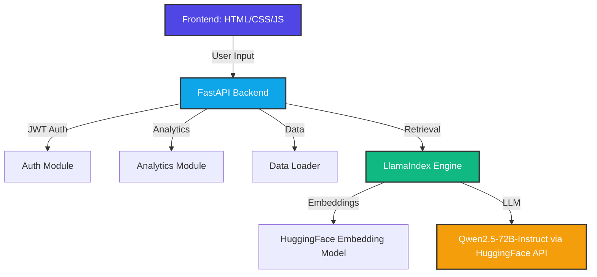
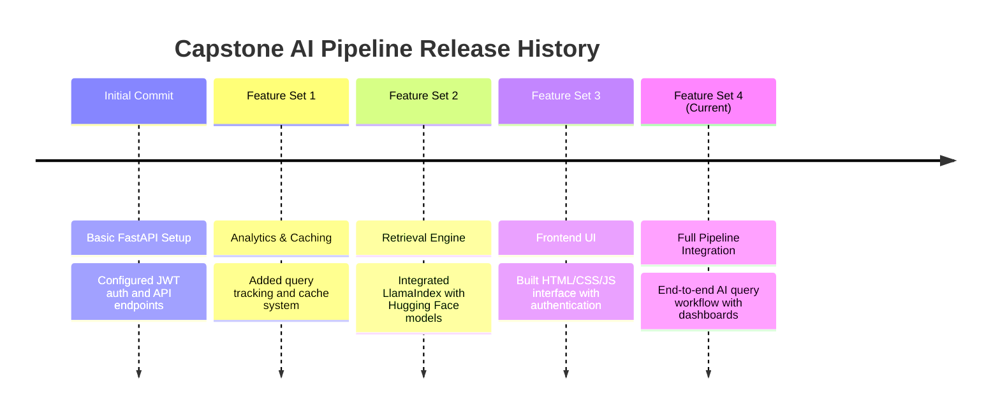

# 🤖 CAPSTONE AI PIPELINE

A full-stack Conversational AI application that integrates **FastAPI**, **JWT authentication**, **LlamaIndex retrieval**, and a modern **HTML/CSS/JS frontend**. The system provides secure login, analytics dashboards, query caching, and real-time AI responses powered by Hugging Face endpoints.

---

## 🚀 Key Features

* **JWT Authentication & Role Management:** Secure login with role-based access (`user` / `admin`).
* **Analytics & Monitoring:** Tracks queries, response times, and cache usage with detailed summaries.
* **Retrieval-Augmented Generation (RAG):** Uses Hugging Face LLM (`Qwen/Qwen2.5-72B-Instruct`) and embeddings (`BAAI/bge-small-en-v1.5`) for contextual answers.
* **Interactive Frontend:** Clean UI with authentication, dashboard, history, and AI query panels.
* **Query Caching:** Stores and retrieves previous answers for faster response times.
* **Health & Dashboard APIs:** Real-time system status and user analytics.
* **Screenshots & Demo Assets:** Included in `/output` for API response previews.

---

## 🛠️ System Architecture & Tech Stack



### Backend Modules
* **`auth.py`** → JWT token creation, validation, role enforcement  
* **`analytics.py`** → Query tracking, caching, summaries  
* **`data.py`** → CSV data loading and statistics  
* **`retrieval.py`** → LlamaIndex vector store, Hugging Face LLM integration  
* **`models.py`** → Pydantic schemas for requests/responses  

### Frontend
* **`index.html`** → UI layout (auth, dashboard, query panels)  
* **`script.js`** → API calls, token management, AI response rendering  
* **`style.css`** → Modern responsive design with animations  

---

## ⚙️ How It Works (Execution Pipeline)

* **Login:** User authenticates via JWT, token stored in browser.  
* **Query Submission:** User asks a question → sent to FastAPI `/ask`.  
* **Retrieval:** Backend builds vector index from CSV data, runs similarity search.  
* **Generation:** Hugging Face LLM (`Qwen/Qwen2.5-72B-Instruct`) generates contextual answer.  
* **Analytics:** Query cached, response time logged, history updated.  
* **Frontend Display:** Answer rendered with stats (response time, cached, user).  

---

## 📋 Prerequisites & Local Setup

### 1. Repository Setup
```bash
git clone <repository-url>
cd CAPSTONE
```

### 2. Environment Configuration
Create a `.env` file in your root workspace folder:
```env
SECRET_KEY=your_secret_key_here
ALGORITHM=HS256
ACCESS_TOKEN_EXPIRE_MINUTES=30
HUGGINGFACEHUB_API_TOKEN=your_huggingface_token_here
```

### 3. Installation
Install dependencies:
```bash
pip install -r requirements.txt
```

---

## 🏃 Execution

Start the backend:
```bash
uvicorn main:app --reload
```

Access the frontend:
```
http://localhost:8000
```

---
🖼️ Demo Screenshots
Here are sample screenshots from the /output folder:


---

## 📈 Development Roadmap & Git History



* **Initial Commit:** Basic FastAPI setup with JWT auth.  
* **Feature Set 1:** Analytics and caching system.  
* **Feature Set 2:** Retrieval engine with Hugging Face LLM + embeddings.  
* **Feature Set 3:** Frontend UI with authentication, dashboard, history.  
* **Feature Set 4 (Current):** Full-stack integration with AI query pipeline.  

---

## 🤝 Contributing
Pull requests are welcome! For major changes, please open an issue first to discuss what you’d like to change.

## 🔗 [CAPSTONE Repository](https://github.com/Vedantjaiswal4352/CAPSTONE)

